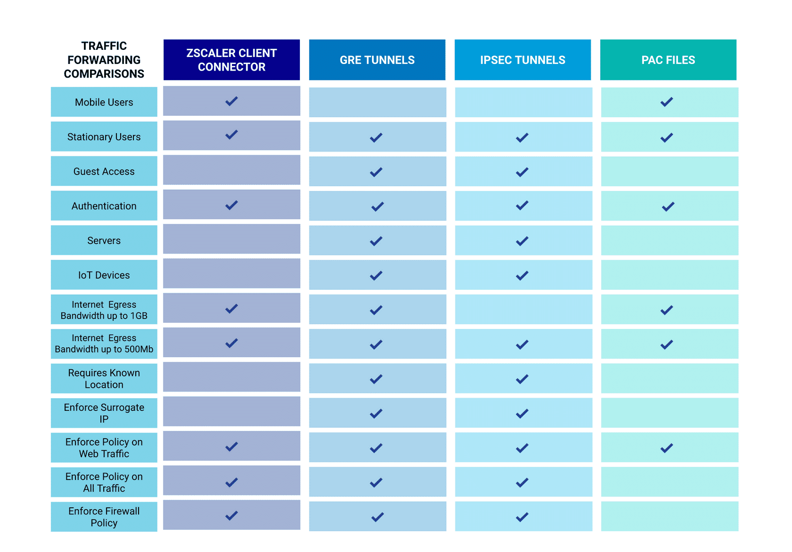

#  Deployment methodology and delivery

[TOC]

## Delivery Methodology 

Methodology = Blueprint.  Inneheld repetable processes, BestPractice guidelines. 

Delivery methodology milestones:

* Repetable processses
* Faster adoption 
* Value realization

Zscaler main objective in customer deployment. 

* Shorten time to value
* Accelerate future adoption of platform capability. 

#### Key deliverables for deploy

1. A documented design plan. Defining the key elements of cust-env, architecture and provided protection. 
2. Clear testing and acceptance criteria for key user groups. 
3. Define production rollout schedule and completion target for remaining groups. 

Template docs i PS Toolkit i Partner portal. 

## Project methodology

Sett milestones. 

- Pilot traffic Date
- Production traffic date
- fully deployed date
- Any change freezes? 
- Critical deadlines. 

## Delivery Phases
### Phase1 - Planning & Design

**Planning**

* Sales handoff
* Introduction 
* project kickoff

**Design**

* Complete design
* Document design 
* Migration strategy 
* test strategy

Key Focus: Establish engagement logistics (planning) and design discovery

Goal:  Develop final architectural Design plan 

Deliverables: HLD / LLD,  customer sign off. 

### Phase2 - Initial Config

**Config guidance**

* Traffic forwarding 
* Authentication
* Policy Structure
* Reporting

**Test guidance** 

* Internal IT testing
* test key apps 
* Test business process

Key focus:  Translate design into tenant config and validate. 

Goal: Create test criteria for pilot and prod 

Deliverables: Complete config and core design elements,  Defined test and acceptance critera. 

### Phase3 - Traffic Rollout

**Pilot**

* Select users
* 1 site
* 10 users

**Production** (også kalla Traffic forwarding phase?)

* Production 
* Multiple sites
* Mobile users. 

Key Focus: Validate production design, user experience, and rollout readiness. 

Goal: Controlled testing through pilot, final design updates, production rollout plan. 

Deliverables: Defined Pilot User Groups, User acceptance Test criteria, Defined rollout schedule. 

-------------------------------------------------------------------

## Phases Deep Dive

### Phase 1 - Planning

3 Element.  

* Internal Handoff 

* Customer Communication and schedule

* Project kickoff. 

**Design Questionnaire** bør fyllast ut i internal handoff. 

* Helps drive the planning of the design phase. 
* Ensures all questions are answered and planned upfront. 

Begynn utfylling i internal handoff  (project / Delivery team)

Fortsett sammen med kunde, review i kick-off og design workshops. 

Er eit tool for å styre design discovery. 

**Project kick-off**

Important topcs and goals:

* Introduce project team and key stakeholders.  On both teams. 
* Establish meeting cadence??, communication prefrence, escalation process. 
* Discuss project timelines, document important customer timelines / milestones. 
* Discuss and schedule workshop meetings for key design area. 

### Phase 1 - Design 

* Discovery process, initial assessment of cust-env. 
* WHY - Project teams use workshop to review, discouss outline prefered implementation considerations. 
* Workshops sammen med design questionare provide basis for config and architecture. raf
  * Traffic forwarding
  * authentication
  * policy enforcement 
  * reporting and logging. 

Best practices & Resources. 

* Zscaler golden configuration - Supported configs, provide low risk approach. 
* Best practice guides. 
* Initial design documents. 

### Phase 2 - Initial config

To faser.  **Config** og **Test** 

Translates the customers design to zscaler tenant config. 

### Phase 3 - traffic rollout 

To faser:  **Pilot** og **Rollout**

* Smal-scale pilot users. 
  * Select to represent Divers Cross-section of user population. 
  * diverse:  Department, regions, app-requirements. 
  * Brukera er aktive piloter. 
* Production rollout: 
  * small groups of highly knowledagble users. Eks:
    * phase1 - 20-50 users (IT Test)
    * Phase2 - expanded extra 100-150 users. 
    * Phase3 - end user group . 200-300 nye users. 
    * Phase4 - Resten. 
  * Kvar phase har Action, Goal, success criteria. 

----------------------------------------------

## Project closeout 

**Zscaler mission critical audit.  ZMCA**

* Config audit to ensure critical configuration options align with Zscaler Best Practice. 
* Gives customer confidence their implementation follow best practice. 
* Ensure customer understand any existing config risks. 

**Project summary report** 

* overall project status,  ZMCA, Milestone review.  
* Info to report any issues with support. 

----------------------------------------------------------------------------------------

## Design and Deployment Practices

4 Main Design Categories. 

1. User auth and provisioning
2. Traffic Forwarding 
3. Policy Design 
4. Logging and reporting

### User auth and provisioning.  - Recomended Design. 

Zscaler recommended solution: 

* Provisioning - SCIM (System for Cross-Domain Identity management)
* Authentication - SAML
  * Many providers (Azure AD, Okta, etc)
    * Standards-based 
    * Vendor agnostic
    * HA regardless of location. 
    * Dynamically updated for users in Zscaler as changes happen in SAML-solution. 
* SCIM  - Recomended Provisioning method. 
  * Users and groups provisioned via APIs. 
  * Zscaler is updated in near real-time when User-DB changes. 
  * No inbound connection from Zscaler to customers user directory required. 
  * Integration with IdP simplified through zscaler tech partners. 
  * **Require**
    * IdP must support SCIM 2.0
    * Sync Delay between IdP and zscaler varies.  Azure 40 min, others 1 min.  Default values, configurable. 
  * **Limitations**
    * Sync must happen before authentication will work. Needs to be planned before activation. 
    * Sync interval.. 
    * Some IdP do not support SCIM provisioning 
    * Zscaler recomend not having SAML provisioning and SCIM-sync enabled at same time. 
* SAML - Recomended Auth method. 
  * Standards-based
  * Vendor independent 
  * Do not need a direct interaction between Auth-Requester (Zscaler) and Authenticator (IdP)
  * Users are ID'ed once to a IdP. 
  * **Benefits**
    * No change to firewall setup.   No requirement for direct connectivity between Service Provider and IdP. 
    * First time auth can be transparent to the user. 
  * **Requirements**
    * Need to obtain and implement the SAML service. 
    * For cloud based IdP:  Check regional availability. 

**Limitations and Requirements of Design**

* Customer MUST use publicly accessible SAML-IdP. 
* Users are limited to membership of 128 user-groups.  Can be extended to 1000 by Zscaler support. 

### User auth and provisioning - Understand the Design. 

Ting å sjekke under discovery:  
Kor mange auth domains, forskjellige AD-domener?  Skal alle bruke zscaler? 

Additional domains krever Zscaler support. 

Re-Authentication intervals: 

* Default for ZIA er Auth once. 
* Kan endre til td once per session, or a interval (per day)

SCIM sync tar tid å synce.  Kan lede til issues med user-sync i starten. 

###  Traffic forwarding

* Recommended approach er å starte med Zscaler Client Connector.  Then add GRE to forward traffic such as  IOT, guests,  or servers. 

* Pass på behov for ekstra NAT-adresser ved mange brukera.  1000+ 

* Dersom site har både GRE-tunell og Zscaler Client connector pass på att ClientConnector blir ruta utanom GRE og IPSEC tuneller.   Spesielt viktig dersom ClientConnector er satt til å bruke DTLS. 
  PBR er nevnt som løysing. 

**ClientConnector**

* Recomended pga 
  * Ease of use
  * Flexibility in configuration 
  * Multiple uses with zscaler platform. 
  * Tilgjengelig for alle store OS. 
  * Geolocation awareness.  Uses zscaler clouds distributed infratructure. 
  * Forskjellige zscaler produkter kan brukast av klienten basert på lokasjon (trusted net, vpn-trusted net, no-trusted net). 
  * Kan styre kva trafikk som skal forwardast til zscaler service og koreleis  (split-tunneling)
  * Built-in tools like logging og packet capture. 

**Gre-tunell**

**Benefit**

* Mange lokale segment over 1 tunell 
* Maks 1 gbps per tunell 
* Can be load-balanced.  På kunde-lokasjon. 
* Self-provisioning frå mgmt-console.  (Zscaler support må enable. )

**Requirement**

* Krever statisk public IP for kvar tunell 
* Zscaler vil ha non-nat'ed IPs to be routed over tunell. 
* Must be associated with a "Known location" 

**Limitation**

* Not encrypted

**IPSEC-tunell**

**Benefit**

* Maks 500mbps per tunell 
* Egress IP from customer can be dynamic 
* Provisioned in ZIA Mgmt console. 

**Requirements**

* Must use public IP / FQDN 
* Multiple tunnels must be load-balanced at customer end. 
* Zscaler prefer phase2 to not be encrypted...!  (Encryption can be used for extra charge)
* Zscaler prefer non-nated IP to be routed over tunell. 
* Must be associated with "Known location"

**Limitations**

* Phase2 encryption cuts bandwidth to 250mbps. 
* IPSEC does not allow for multiple network segments to be routed over a single IPSEC tunnel unless the IPSEC tunnel is created with a transit network that is linked to the Zscaler Data Center

**PAC-Files**

**Benefits**

* Raskaste måte å sjekke tilgang til ZIA
* Krever ingen client software. 
* Kan brukast til å omgå att web-trafikk blir sendt til Zscaler. 
* Kan testast i any browser. 

**Requirements**

*	Limited to only http apps, som er proxy-aware  ( I praksis browsers)
*	Best practice er å hoste PAC-files på Zscaler-cloud. 
  *	Funksjoner som Geo-IP proxy-config er kun tilgjengelig dersom fila er hosta i cloud. 

*	Proxy port subscription for SSL inspection. 

**limitations**

* Blir fort komplekst. 
* Funker kun med browser-basert trafikk. 

#### Forwarding Reference chart 

### Traffic forwarding - Understand the design 

* Må forstå korleis trafikk går til internet i dag, og korleis det vil gå post-deployment. 

> [!IMPORTANT]
>
> * Client connector er førstevalg.   Client-Connector for klient-trafikk. 
> * GRE for Servers / IoT.  1Gb limit,  load-balance dersom høgre bandbredde. 
> * IPSEC dersom kryptering er krevd, kun 250mbps. 

### Policy Design - Overview 

* Start med generelle policyer som gjelder alle / mest mulig brukera i org-en. 
* Dersom ein erstatter ei eksisterande løysing - Sjå på mulighet for å rydde i policyer.  Simplify og reduser antall. 
* Ikkje berre dupliser reglar frå gammal løysing til Zscaler, forstå tanken bak ein policy for å implementer korrekt  (intent behind the policy). 

### Policy Design -  Options

End goal er å lage eit policy-set som "Meet or exceed the customers expectations while not compromising good security practices". 

Policy creation og maintenance is a always evolving process.  

**All policy types has has a recommended setting from Zscaler i admin-portalen.** 

**Basic policy types **

* SSL Inspection 
* URL Filtering  & Cloud app Control 
* Malware protection 
* Sandbox 
* Firewall 

Zscaler recomended approach for each type. 

> [!TIP]
>
> *ZCDS module* - Har best practice, teori og customer cases + deeper info for kvar policy type. 

#### SSL Inspection 

* Default is to **NOT** Inspect. 
* Recomended er Inspect **ALL**. Med so få unntak som mogleg. 
* Create a new rule that inspects all categories og sett den over *default buypass policy*

#### URL Filtering & Cloud App Control 

* Cloud App Control er recomended over URL-Filters, for Block access to sites or categories. 
  * Trenger ikkje å vedlikeholde URL-Lister. 
  * Lat Cloud App Control gjenkjenne applikasjonane og automatisk sette policy. 
  * Bruk URL-Filters om fall-back for apps som ikkje blir gjenkjent. 
* Zscaler recomendation: 
  * Editing Block-Known-Bad-URL-Categories by adding all sub-categories in Adult Material Main Category.  And then enable it. 
  * Alternativt lag ny rule som blokker alle Categories in the Legal Liabilty Class. 

#### Malware protection
* zscaler Recomends that the default malware protection setting is enabling inspection of FTP traffic 

#### Sandbox 

* Basic cloud sandbox subscription - not offered anymore 
* Analysis of: 
  * Windos exec 
  * DLL 
  * ZIP's 
  * If file is less than 2MB 
  * Must be downloaded from specific suspicious URL's
* Advanced Cloud Sandbox 
* Recomendation is: 
  * Create new policies to include all supported file types, 
    Enable Quarantine process alongside AI Quarantine Capability for specific URL Categories deemed risy by org policy. 

#### Firewall 

* Two types of firewall: 
  * Standard 
    * Stateful 5-tuple, FQDN oriented FW. 
  * Advanced 
    * User-Based policies 
    * Full App Identification 
    * DNS Control 
    * IPS Control 
    * Detailed Granular Logging. 
* Recomended is: 
  * Keep the default and predefined rules in a Zscaler instance. 
    * Defaults in the different FW-Areas (FW-Control, NAT-Control, DNS-Control, IPS-Control) + more
  * Recomended that you edit and create additional rules to meet deployment requirements. 
  * During initial deployment of Tunnel in Zscaler Client Connector - Bruk default allow all rule.  Lag so meir spesifikke allow-reglar undervegs når trafikk blir identifisert og før slutten av deployment endre default Allow til default Deny. 
  * 

### Logging and reporting

* ZIA customer data is retained for **6 months** in Zscaler Cloud. 

* Kan bruke eit SIEM-verktøy (Security Information and Event Management) med Zscaler.  F.eks Splunk, LogRythm. 

* SIEM kan gi data-insight og long-term archiving av data. 

* Kobling er gjort med NSS (Nanolog Streaming Service).   Har to subscriptions: 

  * NSS for Web - Streamer Web og Mobile traffice logs 
  * NSS for FW - Streamer log frå Advanced Cloud Firewall. 

* Støtter både On-Prem og Cloud SIEM

  **On-Prem NSS**

  * VM appliance som streamer log til SIEM. 

  * Vsphere, AWS, Azure

  * NSS for Web feed outputs: 

    * Tab-Separated 
    * CSV
    * Splunk
    * Ms Cloud App Security 
    * ++ leverandører og Custom. 

  * NSS for Advanced Cloud Firewall outputs: 

    * CSV
    * JSON
    * Name-Value Pairs
    * Tab-seperated
    * Custom. 

    **Cloud-Based NSS**

    * Cloud to cloud streaming.  Cloud NSS
    * Bruker APIer for dytte log frå Zscaler cloud to log-collector on SIEM. 
    * To Cloud NSS feeds per log type (Web, Tunnel, Firewall, SaaS Security)

    
----------------------------------------------------------------------------------------------------------------------------------------

# ZIA - Policy Theory'

## Intro 

**Learning Objectives** 

* **RECALL** the types of polcies as they apply to ZIA
* **DETERMINE** Where and when to leverage the appropriate ZIA Policy
* **APPLY** the appropriate ZIA Policy based on common deploy scenarios. 

## Policy Design Overview 

Three common  types of ZIA deployents to be familiar with. 

1. New deplyments with no existing solution. 
2. Deploy and migrate from existing solution 
3. Rapid deploy in response to an event. 

Alle deploy scenario går gjennom same tre faser med config. 
I kvar fase er det typisk eit sett med policyer som blir konfigurert. 

* Fase1 - Global Control Policies 
  * SSL Inspection
  * Malware Protection 
  * Advanced threat protection 
* Fase2 - Granular Control policies 
  * SSL Inspection  (Granular)
  * URL Filtering & Cloud Apps Control 
  * File type control 
  * Firewall 
* Fase3 - Advanced Control Policies 
  * Cloud Browser Control 
  * Forwarding methods & Control 
  * App Tenant restrictions. 

## Phase1 - Global Control Policies

* Focus on policies requiring minor configuration and will protect the broadest range of users. 

* Most common elements used in all deployments. 

* Often left to default settings. 

* Consist of:

  * SSL Inspect
    * Ensure a defined plan with the least amount of disruption. 
    * Recomendation: 
      Best practice is Enable on a smal group of users. 
    * 
  * Malware protect
    * Recomendation: 
      Inspect FTP
      Find out if you should Allow or Block  password protected files and unscannable files. 
  * Advanced threat protection. 
    * Identify harmful content and scripts on web-pages. 
    * Can set Suspicious Content Protection (Page Risk) value in policy.  (Threshold value)
      * Is calculated in real-time for web-pages. 
    * Recomendation: 
      Defaults. 
      Page-Risk 35
      All defaults are in block. 

  Best practice: 
  Granular rollout of SSLl. 
  Phase1 team-members
  Phase2 Pilot-Group
  Phase3 Org-wide. 

  SSL by default gives a better and more accurate picture of what kind of traffic goes through Zscaler.  Can create better policies. 

  **Excempt spesifikke maskiner frå SSL **

  * Må bruke statisk IP :( 
  * Lag Sub-location på locations som har aktuelle maskinene
  * Lag location-group og legg inn sub-locations. 
  * SSL-Policy i toppen med criteria:  Selected location-group.  Action: Do Not Inspect.  Evaluate other policies (for å bruke ZIA uten ssl)

  

## Phase2 - Granular Control Policies

more customized implementation tuned to the customer’s needs and environment. 

Differences in usage based on deployment type: 

* New deploy: 
  * URL Filtering & Cloud Apps Control, File Filtering og Firewall have quick rollout. 
  * Broser and file type controls are case-by-case for if to apply. 
* Migrate from existing solution: 
  * Clearly understand a existing rules **intent** before replicating it in zscaler. 
  * URL & App control og FW er kritisk å skjønne.  Kan fort ende opp med annleis funksjon eller oppbygging i Zscaler for å få same outcome. 
* Rapid deploy 
  * Timing for a policies deployment depends on its relevance to the event we are responding to. 
  * Lener mot å vere meir forsiktig heller enn åpen. 

### URL-Filter and App-control 

* App-control tar presedens.  
* For å apply url-filter på flow som alt har fått app-control 
  * Advanced settings -> Allow Cascading to URL-Filter. 
* Advanced URL Policy settings - Recomended settings: 
  * Newly registered domain lookup - enable 
  * Dynamic contect registration - enable 
    Dynamisk sjekk av ukjente sider for å sjå om dei går under:  (dult Material, Drugs, Gambling, or Violence.)
  * Enable Embedded sites categorization - enable  
    Enforce url-filter for sider som creates an embeded / encapsulated request.  IE translation services on the web (google translate. )
  * enforce safe-search - enable 
    Krever SSL-Inspection enabled. 

### File type controls

* Default - Allows download and upload of all file types 
* Knytt til URL filtering. Not cloud apps. 
  * Blokke file type in gmail = Select webmail in URL category. 
* Recomendations: 
  *a ‘Caution’ action for Executable downloads from any URL category and ‘Block’ for Executable uploads to any URL category*
  Caution download of Exec.  Block uploades of exec.  For all URL-Categories. 

### Firewall 

* Enabled per site.  Done under *Locations*.  Select **Enforce fiewall  controll**
* Enable IPS if have advanced cloud-gen fw sub. 
* For Tunnel 1.0.  
  Enable in A*dvanced Settings under “Enable Firewall for Z-Tunnel 1.0 and PAC Remote Users (Road Warriors).*

**Recomendation**

* FW policies på non-http trafikk på Client Connector **KREVER** Tunnel 2.0
* Tunnel 2.0 is not enabled by default for Client Connector. 
  * **MUST** be requested from Zscaler. 
* After enabling tunnel 2.0
  * must configure the Forwarding Profile for the Zscaler Client Connector to use it when forwarding traffic. 
  * Tunnel 2.0 allow you to enforce all FW-rules to the users web-traffic.  HTTP or not! 

## Phase3 - Advanced Control Policies

**Cloud-Browser Isolation**

* Laster web-sider i ein browser i Zscaler cloud. 
* Web-sida blir streamed as pixels til user. 
* High-risk web-sites / Safety-Control for high-risk traffic.  CEO. 

**Forwarding Methods and Control**

* Forwarding Control sends selective traffic to specific destinations based on need.
  * Proxy and Gateways - Used when an organization also subscribes to an additional third-party service. 
  * Zscaler Private Access - Used to address Source IP Anchoring needs of an organization. 
* Forwarding policies are applied only to traffic originating from a known location or Zscaler Client Connector.
* Recomendation: 
  *You will only use these features in very specific cases. Consult with a Zscaler technical resource to ensure proper use and design.*

**Application Tenant restrictions**

* Zscaler's Tenancy Restriction feature allows you to restrict access either to personal accounts, business accounts, or both for specific cloud applications
* Recomendation: 
  Ensure to select the cloud applications in your SSL Inspection rule.
* Application Tenancy Restriction is limited to only specific applications. 

