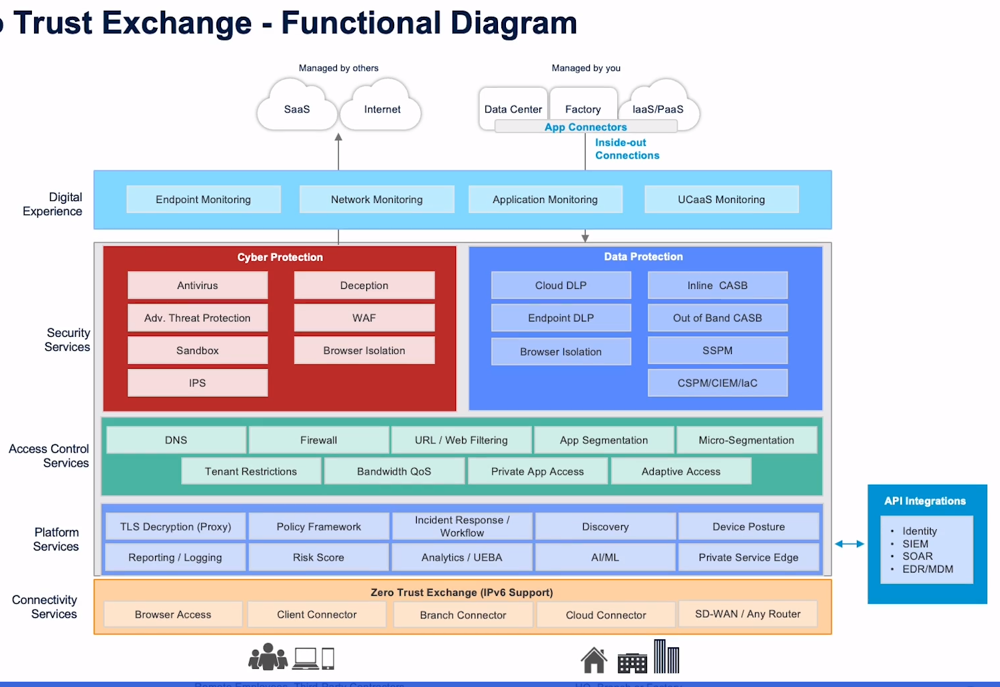
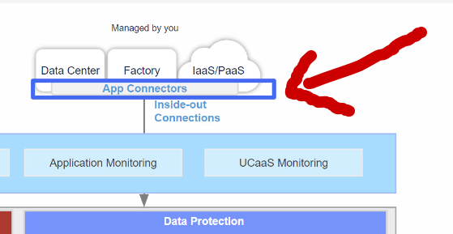
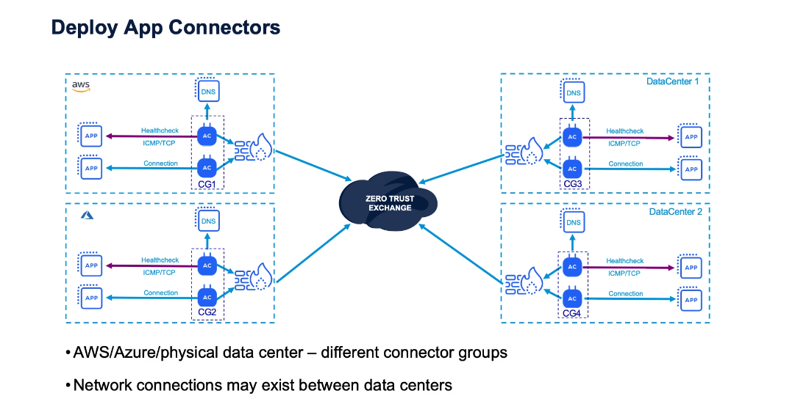
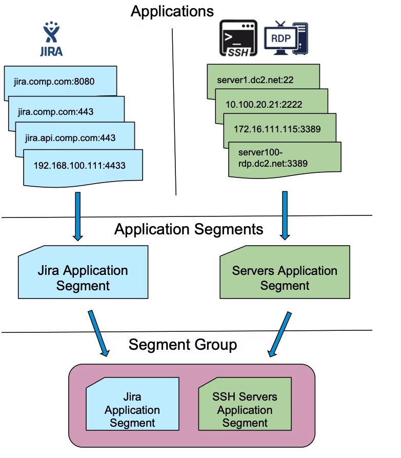
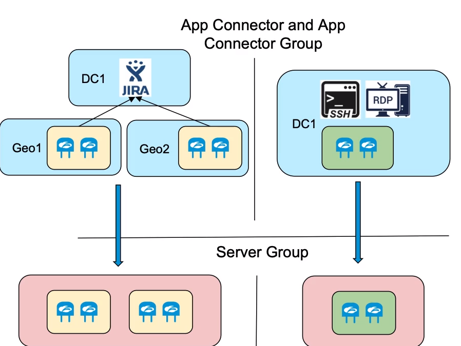
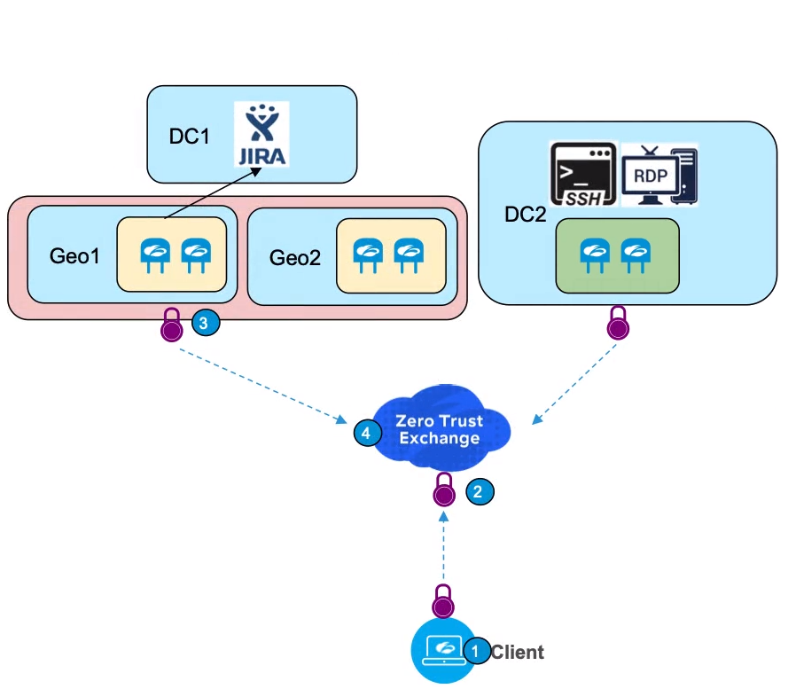

# Zscaler for Users - Essentials (EDU-200)
Mål for cert-path:  

* Gain an overview of Zscaler's Zero Trust Exchange and the key use cases for adopting the Zscaler for Users platform of solutions
* Configure the basic functions of ZIA, ZPA, and ZDX in order to get started utilizing the products
* Explore the services and their capabilities offered by the Zero Trust Exchange including connectivity, platform, access control, cyber security, data protection, and digital experience.
* Identify Zscaler's support ecosystem and how to troubleshoot common issues

[TOC]

# Module 1 - ZTE Overview
Provides three key solutions to provide fast, reliable, secure access to internet, SaaS and private Apps. 

* Secure internet and SaaS Access
* Secure Private Apps Access 
* Digital Experience Monitoring 

ZTE Overview and platform offerings from Zscaler. 

* Zscaler for users 
  * ZIA - Zscaler Internet Access
  * ZPA - Zscaler Private Access
  * ZDX (Digital Experience)
* Zscaler for workloads 
  * Out of scope for denne cert-en. 
  * Brukast i cloud-miljø.  AWS, GCP, Azure. 
  * Secures Workload-to-workload trafikk.  Multic-cloud
  * config and exposure scanning. 
* Zscaler for IoT
  * Secure Internet, SaaS, private app access. 
  * Priviliged access to OT. 

-------------------------------------------------------------------

# Module 2 - Quick Start Guide

* configure and deploy the basic functions of ZIA, ZPA, and ZDX
* View the reports and logs provided in the ZIA, ZPA, and ZDX Administrator portals 

Gørkjedelige videoar.  Useless. 

# Module 3 - Identity Services

## Intro & Learning objective 

* **Recognize**  how auth mechanism work and how they are integrated with Zscaler. 
* **Discover** how to config Zscaler Identity Integration services 

## Connecting to a Idp (idp)

IdP = Identity provider. 

Any SAML 2.0 provider (okta, azure, ADFS, osv )

Støtter SAML og SCIM.  

## Understanding SAML & SCIM
### SAML Auth

SAML = Security Assertion Markup Language

* SAML is a mechanism for *Federating identities between a Identity Store and application*. 
* Provides SSO of users. 
* If users is signed into the IdP they can access app withouth re-authenticating. 
* Also enables exchange of credentials between a few key components. 

**TERMS**

* SP - Service Provider. 
  The application.  Også kalt Relaying Party (RP).  
  * SP Bruker IdP sine tenester for autentisering og autorisasjon av brukera. 
  * Zscaler er ein SAML ServiceProvider. 
* IDP - Identity Provider 
  * The thing that ID and authenticate users and devices. 
* SA / Security Assertion
  * Known as Tokens 
  * Is a XML Document that is the result of authentication. 
  * Er Trust og PKI basert. 
  * SA contains any number of attributes that are specific to Zscaler offerings. 
    Including Auth attributes and authrorisation satements. 
  * Eksempel: 
    * IdP authenticate user,  Validate credentials, og bygger so ein Security Assertion. 
    * SA blir digitalt signert med PKI og sent til SP.  
    * SP validerer signaturen og bruker alle attributes den har fått. 
      (Consumes all the attributes)

### SCIM Auth 

* SCIM = System for CrossDomain Identity Management. 
* Used for provisoning and user & Group Mgmt. 
* Søtter automatisk oppdatering av brukera ved Create, delete og update av users and group attributes. 
  * Eks: 
  * Deleted user in Directory.  SCIM pushes update to Zscaler. 
  * Zscaler will Consume the info, Auto-Disable the user, Revoke access through the platform. 
* SCIM Data Management
  * Read-Only lists are created in ZScaler for: 
    * SCIM Users
    * SCIM Groups 
    * SCIM Attributes. 
  * Users can only be managed in the source directory / IdP
  * Users, groups, attr are updated from the source as changes are made. 
* SCIM Synchronization. 
  * Happens periodically using API. 
    * Auto every 40 min 
    * Manuel trigger anytime. 
  * Updates are queued for sync when: 
    * users are added/removed  to groups mapped to Zscaler SP. 
    * Users are individually assigned to or removed from the ZPA SP 
    * users are deleted from source directory. 
    * user attributes are changed in the source direcotry. 

> [!IMPORTANT]
>
> **Policy consideration when determining SCIM or SAML**
>
> * SAML attributes
>   * Static 
>   * Only applied on authentication 
>   * only changed on re-auth 
>   * can include device and authentication attributes. 
> * SCIM Attributes 
>   * Attributes are dynamic (can change in real-time)
>   * user & Group specific 
>   * will be updated after change in source dir. 
>   * Frequency is IdP controlled. 

### Config guidane 

> [!IMPORTANT]
> Zscaler må ha IdP public cert i PEM-format. 
> 

* SAML Auto provisioning. 
  * Poplulerer Zscaled hosted DB med users automatisk når dei autentiserer med IdP

# Module 4 - Basic Connectivity 

## Learning objective 

**Identify** how ZT components are established in the cloud 

**Recognise** the connectivity services zscaler has in place to connect users and apps  to ZTE. 

**Discover** how to configure Zscaler Connectivity Control Services and Capabilities 

## Connecting to the ZTE 
Zero trust components are established in the cloud, and Users, Devices, IoT and OT devices or workloads must establish connection to the cloud to enforce security policies. 

Zero Trust Connections are by Definition *Independent of any network for control and trust*.  Zero Trust never shares the network between the originator and the destination app. 

## Zscaler Connectivity Services 

### Client Connector 

* Kjem sammen med ZIA, ZPA og ZDX. 
* Lightweight app on users endpoint.  
* Enforces security policies, regardless off device, location or application. 
* **Featues**
  * Consistent experience accross platforms. 
  * strict enforcment options (tamper proof)
  * Simple enrollment
  * Trusted network detection. 
  * User attribution and asset identification 
  * transparent auth for users. 
  * SSL Inspection certificates.  (Zscaler certs or custom certs)
* Protect SaaS and Internet access. 

#### ZIA Forwarding modes 

* Tunnel-based.  Zscaler-tunnel.  Forwarder enkapsulation. 
* Packet Filter Based (Windows)
  * Fanger pakker og styrer dei til Zscaler prosessen som enkapsulerer. 
* Route based. 
  * Lager ekstra nettverksadapter og ruter trafikk gjennom det. 
* Ztunnel with local proxy 
  * Loopback address that appears as a http/s proxy. 
  * System proxy setting blir satt til å styre trafikk til denne http/s proxyen. 
* Tunnell-formats 
  * Ztunell 1.0 
    * HTTP-Connect tunnell. 
    * 80/443 proxy aware traffic only 
    * No encapsulation. 
    * Just adds some user-info in headers so ZTE understands it. 
    * 1 tunell for auth og enrollment. 
    * 1 tunell for policy updates (every 60 min)
  * Ztunnell 2
    * Any TCP/UDP/ICMP 
    * DTLS = UDP = Faster traffic 
    * Fallback to TLS = Integrity. 
    * Tunnel provide Control Channel (Control plane traffic) 
* Trusted network detection 

**Trusted network detection**

Detection av trusted net (office, dc , branch etc.. ) basert på

* hostname/IP - Local resolving. 
* DNS Server on primary NIC 
* DNS Seaerch Domain on primary NIC. 

**App-Profile**

* Different app  profile for win/mac/linux/Android/ IOS
* app-profiler bestemmer forwarding profile. 
  * Og difor forwarding method.  (Tunnel-type, local-proxy, pac-files)
* Definerer trusted on/off trusted network. 

**Deploy SSL Inspection cert**

* Automatic support for Zscaler root ca. 
* upload custom root ca. 

**tunnel 2.0 config **

* Exclude and include traffic på adapter. 
  * Default exclude rfc1918 + Mcast 
  * Include Default 
* Domain includes and excludes. 

#### Forwarding Profile PAC vs App Profile PAC 

**Forwarding Profile PAC**

* Steers traffic towards or away from Client Connector. 
* Controls System PAC File 
  * Decide which HTTP Proxy to use for a specific URL. 
* Har ingenting å gjere med kvar Client Connecctor sender trafikk. Kun kvar User Apps vil sende trafikk. 
  * Bestemmer kvar user-app (edge, chrome, ff) vil sende trafikken.  Til Zscaler proxy eller til lokal Client Connector Proxy. 

**App profile PAC**

* Styrer trafikk mot eller frå Zscaler Cloud. 
* Etter trafikk har blitt intercepted av Tunnel-Mode eller trafikk er mottatt frå Local Proxy the App Profile PAC will process the traffic og bestemme kva for Zscaler Node som skal prosessere trafikken.  
  (Node = ZIA Public or Private Service Edge). 
* App Profile PAC  blir brukt til å finne ut kva som er geografisk næraste Node (Service-Edge) som kan handtere trafikken. 

Forwarding PAC er for WebBrower/System Proxy.  Bestemme om URL skal PROXY eller DIRECT

App Profile PAC er for Client Connector.  Bestemmer kvar client connector skal rute trafikken. 

#### Client Connector Intervals. 

* On network change (connect/disconnect)  Refresh app-profile, forward profile, PAC-files og policies. 
* 15 min.  Download PAC-files for app and forward profiles. 
* 60 min Policy updates frå app og forwarding profile. 
* Dersom PAC-file URL's are changed, it auto-updates every 1 hour.  Because this counts as a profile change. 
* 120 min - Checks for Software updates. 
* Users can force check manuelt. 

#### Rotating passwords 

* Client Connector er låst mot å bli logga ut, disabled eller avinstallert. 
* passord-beskytta. 
  * Unikt, per device. 
  * changes when used. 
  * Tilgjengelig for admin.  Kan gis til user dersom det er behov for uninstall/disable etc. 

### App Connectors 

LES MEIR PÅ DENNE! 

* Deploy i DC og for IaaS
* Alltid deploy i par (2stk) for redundans. 
  * Forskjellige DC = Forskjellige connector group (forskjellig par). 
    * Gjer det same for forskjellige IaaS,  vpc eller regioner. 
  * 1 connector group = 2stk connectors. 
* Pass på att connector har fungerande ruting til internet og til ønska app. 
* Connector har minimum VM requirements, pass på å sjekke det i zscaler doc. 
* Connector må kunne koble til applications for health-checks. 
  * tcp check - open port requirement
  * udp check - Trenger ICMP open, eller inferred from tcp health check 
* source IP for requests mot app vil være AppConnectors sin IP. 
  * Connector IP må være registrert i Sites & Services for AD. 
  * AD bruker source-IP for policyer. 

#### Deploy app connectors - Provisioning keys and certs 

* Create a provisioning key for kvar connector group (pair)
* prov-key er signed by intermediate CA
  * intermediate CA signed by root CA
* Clients  er enrolled mot same intermediate CA. 
* Revoking/deleting intermediates breaks trust.  
  * Will invalidate provisioning keys. 
* Behandle keys som credentials, unngå clear-text sharing. 
  * Bruk API for å generere å hente. 
  * last ned frå UI,  upload til connectors via SSH / SCP

For å deploye App Connector "Add App Connector" og lag ein provisioning key. 

* deploy app connector. 
* Konfigurer *server group*, **server groups** knytter Connector til Applikasjoner. 

**Dynamic Server Discovery** er på som default.  Ikkje anbefalt å fjerne. 

* Gjer automatisk DNS-oppslag.  
* Lager *Syntethic server associations* som annonserer applikasjoner.... ???? 

#### Application, application segment og Segment Group

Ein **Application** er: 

* FQDN
* Wildcard domain 
* IP-adresse med definerte portar eller port-range.  (Unngå if possible)

**Application Segment** 

* Gruppe  av applikasjoner. 
  * Baser på access type eller bruker privilegier. 
* Gruppe-elementer som alle krevs for att ein app skal funke.  Multi-server apps f.eks. 

**Segment Group**

* Gruppe av liknande applikasjoner som du vil ha same policy på. 
  * Same type brukar skal ha tilgang til f.eks Regnskap. 
* Segment groups blir assosiert med Server-Groups. Som igjen er knytt mot App-Connector. 

### Browser access & Priviliged Remote Access 

# Platform Services 
# Zscaler Digital Experience 
# Access Control 
# Cyber Security Services 
# Basic Data Protection Services 
# Basic troubleshooting tools & Support 